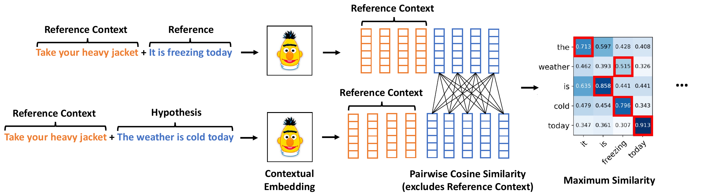

# Embarrassingly Easy Document-Level MT Metrics

## Overview

In this work we extend state-of-the-art Machine Translation metrics, namely [Prism](https://github.com/thompsonb/prism), [COMET](https://github.com/Unbabel/COMET),  [COMET-QE](https://github.com/Unbabel/COMET) and [BERTScore](https://github.com/Tiiiger/bert_score) to the document level. Our approach is _embarassingly simple_: instead of encoding only the hypothesis and reference we also encode the previous reference sentences as context. We still compute the metric score at the sentence level but also attend to previous context.




The extended metrics outperform their sentence-level counterparts in about 85% of the tested conditions ([WMT 2021 Metrics Shared Task](https://wmt-metrics-task.github.io/) ) and dramatically improve the ability of the corresponding model to handle discourse phenomena.

## Usage

The current repository contains code that extends the original MT metrics to document level by providing the option to encode additional context. The code is presented as an extension of the corresponding original codebase. For information on how to use each metric see the corresponding README:
* [COMET/COMET-QE](COMET/README.md) 
* [BERTScore](bert_score/README.md)  
* [Prism](Prism//README.md)

It is recommended to create an environment for this project 
```bash
conda create -n doc-metrics-env python=3.9
conda activate doc-metrics-env
```

## Reproducibility

In order to reproduce the reuslts of the paper, regarding the correlation with human annotations of our (or any other) metrics on the standard test sets from the [WMT Metrics Shared Task](https://wmt-metrics-task.github.io/) see the `reproduce` folder of the corresponding metric.

## Acknowledgments

We would like to thank the community for releasing their code! This repository contains code from [COMET](https://github.com/Unbabel/COMET), [BERTScore](https://github.com/Tiiiger/bert_score) and [Prism](https://github.com/thompsonb/prism) repositories.


## Paper

If you use the code in your work, please cite [Embarrassingly Easy Document-Level MT Metrics: How to Convert Any Pretrained Metric Into a Document-Level Metric](https://statmt.org/wmt22/pdf/2022.wmt-1.6.pdf):

```
@inproceedings{easy_doc_mt
    title = {Embarrassingly Easy Document-Level MT Metrics: How to Convert Any Pretrained Metric Into a Document-Level Metric},
    author = {Vernikos, Giorgos and Thompson, Brian and Mathur, Prashant and Federico, Marcello},
    booktitle = "Proceedings of the Seventh Conference on Machine Translation",
    month = dec,
    year = "2022",
    address = "Abu Dhabi, United Arab Emirates",
    publisher = "Association for Computational Linguistics",
    url = "https://statmt.org/wmt22/pdf/2022.wmt-1.6.pdf",
}
```

## Security

See [CONTRIBUTING](CONTRIBUTING.md#security-issue-notifications) for more information.

## License

This project is licensed under the Apache-2.0 License.

